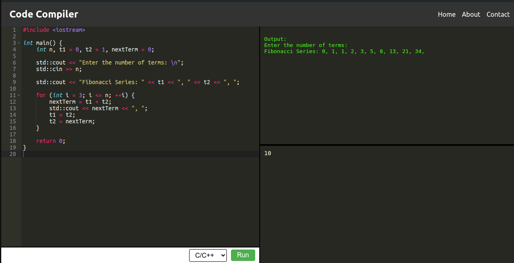

# Code Compiler

## Overview

**Code Compiler** is a web-based code editor and compiler that allows users to write, edit, and execute code in multiple programming languages directly from their browser. The application is built using React and integrates the Ace Editor for a rich text-editing experience with syntax highlighting, customizable themes, and other features.

  

## Features

- **Multi-Language Support**: Supports Python, Java, and C/C++.
- **Syntax Highlighting**: Provided by Ace Editor, with support for various programming languages.
- **Customizable Editor**: Adjust font size, theme, and language mode.
- **Code Execution**: Send code to a backend server to execute and return the results.
- **Standard Input**: Accept user input for programs requiring stdin.
- **Output Display**: Shows the output, errors, or status of the executed code.

## Technologies Used

- **React**: For building the user interface.
- **Ace Editor**: As the code editor with syntax highlighting and other advanced features.
- **Fetch API**: To communicate with a backend server for code execution.
- **CSS**: Custom styling for the application.

## Installation

1. **Clone the repository:**
   ```bash
   git clone https://github.com/yourusername/code-compiler.git
   cd code-compiler
   ```

2. **Install dependencies:**
   ```bash
   npm install
   ```

3. **Run the application:**
   ```bash
   npm start
   ```

4. The application will be available at `http://localhost:3000`.

## Usage

1. **Write Code**: Use the code editor to write your code. Select the desired programming language from the dropdown menu.
2. **Provide Input**: If your code requires standard input, enter it in the "Standard Input" field.
3. **Run Code**: Click the "Run" button to execute your code. The output or any errors will be displayed in the "Output" section.

## Configuration

### Ace Editor Options
- **Themes**: The editor uses the "Monokai" theme by default, but this can be easily changed by importing a different theme from `ace-builds`.
- **Language Modes**: Supports Python, Java, and C/C++. Additional languages can be added by importing the respective mode from `ace-builds`.
- **Autocompletion**: Autocompletion is currently disabled but can be enabled by uncommenting the respective lines in the code.

### Backend Server

Check this repo if you need backend server : https://github.com/NaheedRayan/code-execution-engine

The `runCode` function in `CodeRunner.js` sends the code to a backend server at `http://localhost:8080/submit`. You need to implement or configure this server to handle the code execution requests and return the results.

### Polling for Results
The application polls the backend server for the status of the execution and updates the output accordingly. This is particularly useful for long-running processes.

## File Structure

- **src/components/CodeRunner.js**: Main React component for the code editor and runner.
- **src/components/CodeRunner.css**: CSS styles for the components.
- **src/App.js**: Main application file rendering the `CodeRunner` component.

## Contributing

Contributions are welcome! Feel free to submit a pull request or open an issue to discuss improvements or bugs.

## License

This project is licensed under the MIT License. See the [LICENSE](LICENSE) file for details.

## Contact

For any inquiries, please reach out via [email@example.com](mailto:email@example.com).

